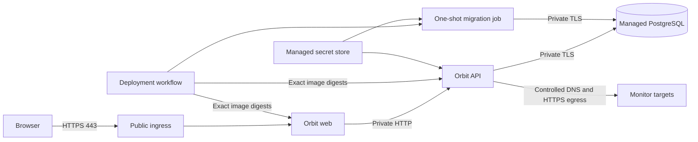

# Orbit Cloud Deployment Contract

Status: Proposed  
Scope: First shared staging environment, provider-neutral  
Last reviewed: 2026-08-11

## Purpose

This document defines the behavior a cloud deployment must provide before Orbit
chooses provider-specific services. It is intentionally stricter than "the
containers start": it covers artifact identity, network boundaries, secrets,
database migrations, health checks, rollback, and operational evidence.

The contract lets us compare Azure, AWS, GCP, or another platform against the
same requirements. Provider selection should change service names, not Orbit's
security and release invariants.

## Current Foundation

Orbit already has:

- separate API, web, and one-shot migration image targets;
- non-root API and web processes with dropped Linux capabilities locally;
- runtime configuration for the web-to-API address;
- a production-like Compose stack with ordered health and migration gates;
- CI jobs for static analysis, unit tests, production builds, and isolated
  PostgreSQL integration tests;
- pull-request container builds that never receive registry write access; and
- GHCR publication with full commit tags, SBOMs, and build provenance.

Orbit does not yet have:

- a selected cloud provider, region, domain, or budget;
- infrastructure as code for a shared environment;
- workload-identity authentication from GitHub to a cloud provider;
- a managed PostgreSQL instance or managed secret store;
- a deployment workflow, traffic promotion, or automated smoke test;
- separate liveness and readiness endpoints; or
- production monitoring, alerting, backup verification, and a recovery drill.

## Runtime Topology

Only the web service needs public ingress. Browser requests use the web
service's same-origin `/api/orbit/*` route, so the API can remain private. The
API and migration job can reach PostgreSQL privately. The API also needs
controlled outbound DNS and HTTP(S) access because checking external targets is
part of Orbit's product behavior.

## Deployment Decisions

| Decision | Contract | Why |
| --- | --- | --- |
| Artifact promotion | Deploy API, web, and migration images by immutable digest. Never rebuild during deployment. | A tested artifact must be the artifact that reaches staging or production. |
| Public boundary | Expose only the web service over managed HTTPS. Keep the API and database private. | This reduces the reachable attack surface and keeps browser traffic same-origin. |
| Database | Use managed PostgreSQL with encrypted connections, automated backups, and point-in-time recovery. | The database is durable state and needs stronger guarantees than an application container. |
| Migrations | Run the migration image once per release before new application traffic. Stop the release if it fails. | Multiple API replicas must not race to modify the schema during startup. |
| Secrets | Read secrets from a managed secret store at runtime. Do not store them in GitHub variables, images, source, or Terraform state output. | Secrets need access control, rotation, and audit history. |
| Deployment identity | Exchange GitHub's short-lived OIDC token for a narrowly scoped cloud identity. Do not create a permanent cloud access key. | A stolen long-lived CI credential has a much larger lifetime and blast radius. |
| Environment isolation | Give staging and production separate databases, secrets, identities, and deployment approvals. | Testing a release must never mutate production state. |
| Rollback | Retain the previous healthy API and web revisions and their exact digests. | Application rollback should be a traffic decision, not an emergency rebuild. |

## Required Runtime Configuration

### Web

| Variable | Source | Requirement |
| --- | --- | --- |
| `ORBIT_API_URL` | Non-secret environment configuration | Private API base URL ending at `/api`. |
| `NODE_ENV` | Deployment definition | Must be `production`. |
| `PORT` | Platform or deployment definition | Must match the service ingress target port. |

### API and migration job

| Variable | Source | Requirement |
| --- | --- | --- |
| `DATABASE_URL` | Managed secret store | Environment-specific PostgreSQL URL using encrypted transport. |
| `JWT_ACCESS_SECRET` | Managed secret store | Unique per environment, randomly generated, and rotatable. |
| `MONITOR_ALLOW_PRIVATE_TARGETS` | Non-secret environment configuration | Must remain `false` outside isolated integration tests. |
| `MONITOR_CHECK_TIMEOUT_MS` | Non-secret environment configuration | Explicit bounded timeout; initial staging value is `10000`. |
| `NODE_ENV` | Deployment definition | Must be `production`. |
| `PORT` | Platform or deployment definition | Valid API listen port; not required by the migration job. |

The migration job receives database credentials but no public ingress. The web
service does not receive database or JWT secrets.

## Network Contract

| Source | Destination | Allowed | Notes |
| --- | --- | --- | --- |
| Internet | Web HTTPS ingress | Yes | TLS terminates at managed ingress. Redirect HTTP to HTTPS. |
| Internet | API | No | API is reached through the web proxy. |
| Internet | PostgreSQL | No | No public database endpoint or public firewall exception. |
| Web | API | Yes | Private service-to-service route only. |
| API | PostgreSQL | Yes | Private network path with TLS. |
| Migration job | PostgreSQL | Yes | Same private path, only while the job runs. |
| API | Public DNS and HTTP(S) targets | Yes | Required for monitor checks; private/reserved targets remain blocked. |
| Web | PostgreSQL | No | The web tier has no reason to hold database credentials. |

The existing monitor request protections remain mandatory in cloud hosting.
`MONITOR_ALLOW_PRIVATE_TARGETS=false` is a defense against server-side request
forgery; network egress policy is an additional layer, not a replacement for
application validation.

## Release Sequence

1. Require the CI and container-validation checks for the candidate commit.
2. Publish all three images and record their digests plus source commit.
3. Acquire one deployment concurrency lock for the target environment.
4. Authenticate to the cloud through GitHub OIDC.
5. Select the already-published API, web, and migration digests.
6. Verify that each artifact is associated with the expected repository and
   source revision. Attestations exist today; automated policy verification is
   still a required implementation step.
7. Run the migration image as a one-shot job and wait for exit code zero.
8. Create an API revision without sending public traffic to it.
9. Wait for API readiness, then create the web revision against that API.
10. Run same-origin smoke checks through the web ingress.
11. Promote traffic to the healthy revisions and record the release.
12. Keep the previous healthy revisions available for a bounded rollback window.

Production should add an environment approval before step 5. Staging can deploy
automatically after a protected `main` build once the workflow is trusted.

## Database Change Rule

Application rollback cannot automatically reverse arbitrary database changes.
Therefore migrations must follow an expand-and-contract sequence:

1. Expand: add nullable columns, new tables, or compatible indexes.
2. Deploy code that can work with both the old and expanded schema.
3. Backfill data with an observable, restartable operation when needed.
4. Switch reads and writes to the new representation.
5. Contract in a later release only after old code can no longer receive traffic.

Destructive migrations must not share a release with the first code that stops
using the old schema. Prisma migrations remain committed and reviewed; rollback
normally restores application revisions while the compatible expanded schema
stays in place.

## Health and Rollback Contract

The current API `/api/health` response checks database connectivity, so it is a
readiness signal: an instance should not receive requests when it cannot serve
database-backed behavior. The current web root can act as an initial readiness
signal.

Before production, Orbit should separate:

- liveness: the process and event loop are alive, without depending on
  PostgreSQL; and
- readiness: the instance can serve real requests, including required database
  connectivity.

This separation prevents a temporary database outage from causing every API
container to restart simultaneously. A failed deployment must stop traffic
promotion. A post-promotion regression rolls API and web traffic back to the
previous recorded digests; it does not run an automatic down migration.

## Observability Contract

The first shared staging environment must provide:

- timestamped structured application logs with environment, service, revision,
  request correlation, route, status code, and duration;
- platform metrics for replicas, restarts, CPU, memory, request rate, latency,
  and server errors;
- PostgreSQL metrics for connections, storage, CPU, failed connections, and
  backup status;
- alerts for failed deployments, unhealthy revisions, sustained server errors,
  database exhaustion, and backup failure; and
- a release record linking environment, Git commit, three image digests,
  migration result, actor, and timestamp.

Logs must not contain bearer tokens, passwords, complete database URLs, or
arbitrary response bodies from monitored targets.

## Staging Acceptance Checklist

A provider-specific implementation satisfies this contract only when we can
demonstrate all of the following:

- infrastructure can be created reproducibly from reviewed code;
- GitHub authenticates without a stored cloud access key;
- only web ingress is publicly reachable;
- API and migration connect to PostgreSQL through a private encrypted path;
- secrets are referenced from the managed secret store;
- a release deploys exact image digests after a successful migration;
- a deliberately failing migration prevents application promotion;
- readiness failure prevents traffic promotion without causing a restart loop;
- a smoke test reaches `/api/health` through the web's same-origin proxy;
- the previous application revision can be restored without rebuilding;
- database backup retention is configured and a restore procedure is recorded;
- logs and metrics identify the deployed Git revision; and
- staging resources have budgets, ownership tags, and a documented teardown path.

## Inputs Needed for Provider Selection

Before writing provider-specific infrastructure, choose:

1. cloud provider and account or subscription;
2. primary region and any data-residency constraint;
3. staging budget ceiling and acceptable scale-to-zero behavior;
4. domain or temporary provider hostname;
5. whether staging is public, IP-restricted, or identity-gated; and
6. the initial recovery targets for database data loss and service restoration.

The first implementation should optimize for a small, understandable staging
environment. Multi-region availability, a scheduler fleet, production paging,
and zero-downtime destructive schema changes are later concerns, not features to
simulate before Orbit needs them.
